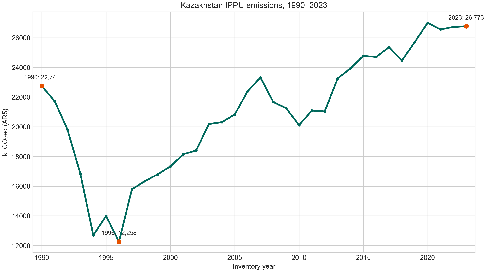
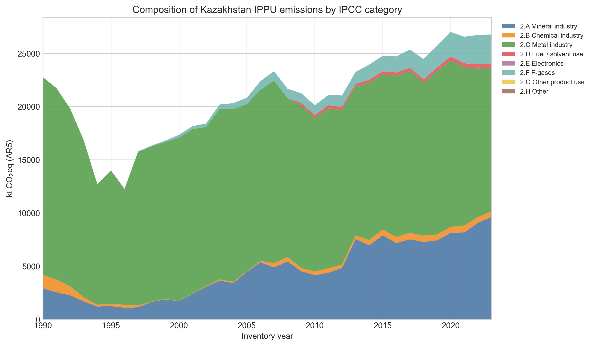
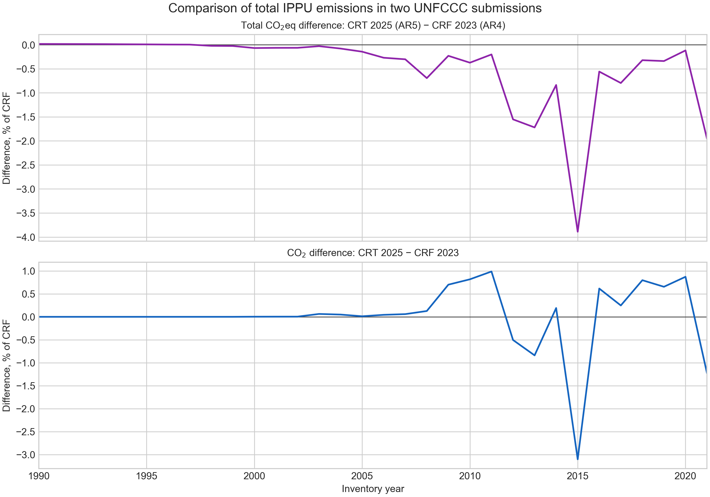

# Article analysis: historical series and CRF–CRT comparison

Русская версия: [article_analysis.md](article_analysis.md).

## Purpose

This document records results already suitable for the *Results* and *Discussion* sections of **LEAP-Based modeling of Decarbonization pathways in the IPPU sector of Kazakhstan**. All calculations are reproduced by [`analyze_ippu_timeseries.py`](../scripts/analyze_ippu_timeseries.py).

## 1. IPPU emissions trend, 1990–2023

The source is Kazakhstan CRT 2025 `Table 2(I)`. Values are kt CO2eq with AR5 GWPs.

| Indicator | Value |
|---|---:|
| 1990 | 22,741.283 kt CO2eq |
| Minimum: 1996 | 12,257.786 kt CO2eq |
| 2023 | 26,772.704 kt CO2eq |
| Change, 1990–1996 | −46.1% |
| Change, 1996–2023 | +118.4% |
| Change, 1990–2023 | +17.7% |

**Suggested caption:** *Figure 1. Trend in Kazakhstan’s total IPPU emissions, 1990–2023, kt CO2eq (AR5 GWPs). Source: Kazakhstan CRT 2025, Table 2(I); authors’ calculations.*

## 2. Emissions composition

| IPCC category | 1990 share | 1996 share | 2023 emissions | 2023 share |
|---|---:|---:|---:|---:|
| 2.A Mineral industry | 12.8% | 8.9% | 9,636.666 | 36.0% |
| 2.B Chemical industry | 5.6% | 2.2% | 510.430 | 1.9% |
| 2.C Metal industry | 81.6% | 88.9% | 13,485.785 | 50.4% |
| 2.D Fuel/solvent use | 0.0% | 0.0% | 414.750 | 1.5% |
| 2.F F-gases | 0.0% | 0.0% | 2,722.441 | 10.2% |

Categories 2.E, 2.G and 2.H are zero or negligible in the displayed benchmark years. Metal industry remains the dominant source, but its share fell from 81.6% in 1990 to 50.4% in 2023, while 2.A and 2.F increased in importance.

**Suggested caption:** *Figure 2. Composition of Kazakhstan’s IPPU emissions by IPCC category, 1990–2023, kt CO2eq (AR5 GWPs). Source: Kazakhstan CRT 2025, Table 2(I); authors’ calculations.*

## 3. CRF 2023 and CRT 2025: a valid comparison

CRF 2023 covers 1990–2021 and its CO2eq totals are calculated from component gases using AR4 GWPs; CRT 2025 reports total CO2eq using AR5. The CO2eq panel in Figure 3 is therefore an indicator of differences between two submissions, not a pure inventory-revision estimate. CO2-only comparison is less sensitive to GWP changes, but does not by itself establish the cause of differences.

| Year | Total CO2eq difference, CRT−CRF | CO2 difference, CRT−CRF | Main contributors to total CO2eq difference |
|---:|---:|---:|---|
| 2020 | −31.915 kt (−0.118%) | +0.872% | 2.B: −21.692 kt; 2.A: +11.001 kt |
| 2021 | −530.264 kt (−1.958%) | −1.231% | 2.A: −468.084 kt; 2.B: −25.384 kt |

In 2021, 2.C changes minimally (+4.139 kt CO2eq; +0.028%), whereas the difference is concentrated in 2.A. This supports targeted examination of mineral-industry methodology, but not a claim of rising uncertainty across the entire inventory.

**Suggested caption:** *Figure 3. Relative difference in total IPPU emissions between CRT 2025 and CRF 2023. The upper panel compares CO2eq calculated with different GWP sets (AR5 and AR4); the lower panel compares CO2. Source: Kazakhstan CRF 2023, Table 2(I)s1, and Kazakhstan CRT 2025, Table 2(I); authors’ calculations.*

## Result files

- `data/processed/ippu_historical_summary_1990_2023.csv` — total series and annual changes;
- `data/processed/ippu_category_shares_1990_2023.csv` — categories and shares;
- `data/processed/crf_crt_total_ippu_comparison_1990_2021.csv` — full total-IPPU comparison;
- `figures/figure_1_ippu_total_emissions_1990_2023.png`;
- `figures/figure_2_ippu_category_composition_1990_2023.png`;
- `figures/figure_3_crf_2023_vs_crt_2025_total_ippu_comparison.png`.

## Results wording

“According to CRT 2025, Kazakhstan’s total IPPU emissions fell from 22,741 kt CO2eq in 1990 to 12,258 kt CO2eq in 1996, before recovering to 26,773 kt CO2eq in 2023. Metal industry remained the largest category, although its share fell from 81.6% to 50.4%; the shares of mineral industry and F-gases increased. In overlapping years, the total-IPPU difference between CRT 2025 and CRF 2023 was −0.118% in 2020 and −1.958% in 2021. However, these CO2eq values combine AR5 and AR4 submissions and should not be interpreted as pure inventory revisions.”

