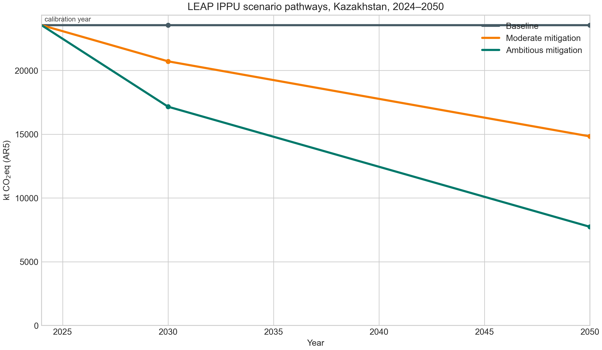
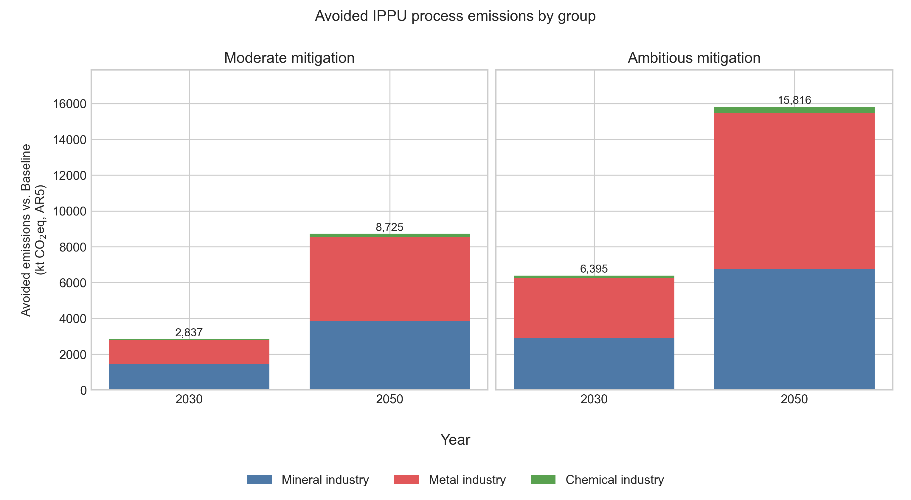

# LEAP IPPU scenarios, 2024–2050

Русская версия: [leap_scenarios_2023_2050.md](leap_scenarios_2023_2050.md).

## Purpose and status

This document records the 2024–2050 IPPU pathways calculated in LEAP 2026.5.0.1. They are **exploratory sensitivity pathways**, not forecasts, least-cost pathways or an assessment of Kazakhstan’s NDC compliance. The corrected result export applies AR5 100-year GWPs: CO2 = 1, CH4 = 28 and N2O = 265.

The model uses `Non Energy Effect Loading` and `Interp()` expressions. The corrected [LEAP import workbook](../outputs/leap_ippu_import/Kazakhstan_IPPU_LEAP_final_import.xlsx) is retained in the repository. The result export is stored locally as an immutable raw source and its provenance is recorded in the source registry. The CSV and figures reproduce the exported scenario expressions.

## Model boundary

The 2024 Current Accounts boundary covers these process-emission branches:

| Group | Included processes |
|---|---|
| Mineral industry | cement, lime, glass, other carbonate uses |
| Metal industry | pig iron, steel, sinter, pellets, ferroalloys (CO2 and CH4), aluminium (CO2), zinc |
| Chemical industry | ammonia, nitric acid (N2O), calcium carbide |

F-gases, aluminium PFC emissions, lead and other non-listed IPPU sources, and industrial fuel-combustion emissions are excluded. The baseline of **23,552 kt CO2eq** is therefore a selected process-emissions boundary, not a projection of the full national IPPU inventory.

## Scenario logic

`Baseline` holds all included 2024 flows constant. Mitigation scenarios linearly interpolate from the 2024 calibration to stated remaining-emissions factors in 2030 and 2050. They do not separately model activity growth, technology diffusion, fuel switching, costs or plant retirement.

| Scenario | Mineral: 2030 / 2050 | Metals: 2030 / 2050 | Chemicals: 2030 / 2050 |
|---|---:|---:|---:|
| Baseline | 100% / 100% | 100% / 100% | 100% / 100% |
| Moderate mitigation | 85% / 60% | 90% / 65% | 90% / 65% |
| Ambitious mitigation | 70% / 30% | 75% / 35% | 70% / 30% |

Each branch follows `Interp(2024, base, 2030, base × f2030, 2050, base × f2050)`.

### Interpretation and rationale

The factors are **author-selected analytical sensitivity assumptions**. They represent progressively deeper portfolios of recognised measures, not technology-specific abatement potentials, official Kazakhstan targets, a least-cost solution or a plant-level deployment forecast. In broad terms, mineral-process cases represent material/clinker substitution, process improvements and, in the deeper case, capture of residual calcination emissions; metal cases represent material efficiency, scrap/EAF routes where applicable, low-carbon reduction and/or capture; chemical cases represent optimisation, nitric-acid N2O abatement, route change and residual-emission control.

The evidence supports the direction and grouping of these portfolios, but not the exact numerical factors for Kazakhstan. Their full rationale, scope and source list are in [Rationale for exploratory mitigation scenarios](scenario_rationale_en.md). The results must therefore be read as the consequence of stated assumptions under a constant 2024 activity basis.

## Results

| Scenario | 2030, kt CO2eq | 2050, kt CO2eq | Reduction vs baseline, 2030 | Reduction vs baseline, 2050 |
|---|---:|---:|---:|---:|
| Baseline | 23,552 | 23,552 | — | — |
| Moderate mitigation | 20,715 | 14,827 | 2,837 | 8,725 |
| Ambitious mitigation | 17,157 | 7,736 | 6,395 | 15,816 |



*Figure 4. LEAP IPPU process-emissions pathways, Kazakhstan, 2024–2050. Baseline is flat by construction.*



*Figure 5. Avoided emissions relative to the flat Baseline, by broad process group. Values exclude sources outside the model boundary.*

## Reproducibility

| Asset | Role |
|---|---|
| [LEAP import workbook](../outputs/leap_ippu_import/Kazakhstan_IPPU_LEAP_final_import.xlsx) | Corrected Current Accounts values and scenario expressions |
| [Scenario-results CSV](../data/processed/leap_ippu_scenario_results_2024_2050.csv) | Annual process, gas and scenario results |
| [Calculation script](../scripts/analyze_leap_scenarios.py) | Recreates the CSV and Figures 4–5 from the LEAP expressions |
| [Workbook-preparation script](../scripts/fill_leap_import_template.py) | Writes corrected expressions into a LEAP export template |

To recreate the analytical artefacts:

```bash
python scripts/analyze_leap_scenarios.py
```

## Article-safe wording

Use: “Under exploratory LEAP scenarios calibrated in 2024, included IPPU branches decline to 20,715–17,157 kt CO2eq in 2030 and 14,827–7,736 kt CO2eq in 2050, relative to a flat 23,552 kt CO2eq baseline.”

Do not claim that Kazakhstan’s entire IPPU sector will emit 7,736 kt CO2eq in 2050, or infer costs, technology-specific feasibility, or compliance with national targets.
