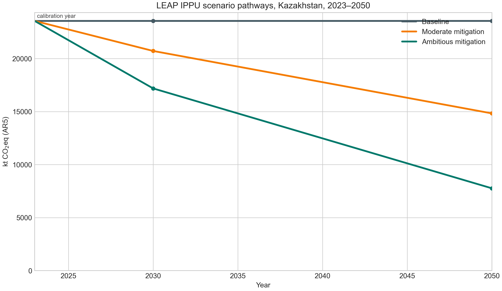

# Exploratory IPPU scenarios, 2023–2050

Русская версия: [leap_scenarios_2023_2050.md](leap_scenarios_2023_2050.md).

## Purpose and status

This document records the scenario design behind the project’s 2023–2050 IPPU pathways. The scenarios are **exploratory sensitivity pathways**, not forecasts, least-cost pathways, or an assessment of Kazakhstan’s NDC compliance. They show the scale of change implied by transparent emissions-reduction assumptions applied to a 2023-calibrated process-emissions boundary.

The LEAP import workbook is available at [outputs/leap_ippu_import/Kazakhstan_IPPU_LEAP_final_import.xlsx](../outputs/leap_ippu_import/Kazakhstan_IPPU_LEAP_final_import.xlsx). The CSV and figures are independently reproducible from the same expressions using `scripts/analyze_leap_scenarios.py`. Before describing these as *LEAP-calculated results* in a manuscript, import the workbook into the desktop LEAP area, run the model, export the results, and verify that the exported totals match the CSV. Until that check is recorded, use the term **LEAP-ready exploratory scenario results**.

## Model boundary

The 2023 base values come from Kazakhstan’s CRT 2025 and are expressed as kt CO2eq using AR5 100-year GWPs (CO2 = 1, CH4 = 28, N2O = 265). The model includes the following process-emission branches:

| Group | Included processes |
|---|---|
| Mineral industry | cement clinker, lime, glass, other carbonate uses |
| Metal industry | pig iron, steel, sinter, pellets, ferroalloys (CO2 and CH4), aluminium (CO2), zinc |
| Chemical industry | ammonia, nitric acid (N2O), calcium carbide |

Excluded from the boundary are F-gases, aluminium PFC emissions, lead and other non-listed IPPU sources, and all emissions from industrial fuel combustion. Consequently, the reported baseline of **23,552 kt CO2eq** is a selected process-emissions boundary, not the national total IPPU inventory of 26,773 kt CO2eq in 2023.

## Scenario logic

`Baseline` holds every included 2023 process-emission flow constant through 2050. The mitigation cases linearly interpolate from the 2023 calibration value to the stated remaining-emissions factors in 2030 and 2050. The factors are emissions multipliers; they do not separately model activity growth, fuel switching, technology diffusion, costs, or plant retirement.

| Scenario | Mineral industry: 2030 / 2050 | Metal industry: 2030 / 2050 | Chemical industry: 2030 / 2050 |
|---|---:|---:|---:|
| Baseline | 100% / 100% | 100% / 100% | 100% / 100% |
| Moderate mitigation | 85% / 60% | 90% / 65% | 90% / 65% |
| Ambitious mitigation | 70% / 30% | 75% / 35% | 75% / 35% |

The interpolation begins in 2024. In LEAP notation each branch follows an expression of the form `Interp(2024, base, 2030, base × f2030, 2050, base × f2050)`.

## Results

| Scenario | 2030, kt CO2eq | 2050, kt CO2eq | Reduction vs baseline in 2030 | Reduction vs baseline in 2050 |
|---|---:|---:|---:|---:|
| Baseline | 23,552 | 23,552 | — | — |
| Moderate mitigation | 20,715 | 14,827 | 2,837 | 8,725 |
| Ambitious mitigation | 17,182 | 7,761 | 6,370 | 15,791 |



*Figure 4. Exploratory IPPU process-emissions pathways for Kazakhstan, 2023–2050. The 2023 point is calibrated to the included CRT 2025 process-emissions boundary; Baseline is flat by construction.*


*Figure 5. Avoided emissions relative to the flat Baseline, decomposed by broad process group. Values exclude sources outside the model boundary.*

## Reproducibility and final LEAP check

| Asset | Role |
|---|---|
| [LEAP import workbook](../outputs/leap_ippu_import/Kazakhstan_IPPU_LEAP_final_import.xlsx) | Current Accounts values and scenario expressions, preserving LEAP identifiers |
| [Scenario-results CSV](../data/processed/leap_ippu_scenario_results_2023_2050.csv) | Full process, gas, scenario and year-level table |
| [Calculation script](../scripts/analyze_leap_scenarios.py) | Recreates the CSV and Figures 4–5 |
| [Workbook preparation script](../scripts/fill_leap_import_template.py) | Writes the calibrated expressions into an exported LEAP template |

To recreate the analytical artefacts:

```bash
python scripts/analyze_leap_scenarios.py
```

To complete the LEAP verification: set Current Accounts to 2023 and the end year to 2050; import the workbook into the matching LEAP area; calculate the three scenarios; export process-emissions results; and compare the 2030 and 2050 totals with the table above. Record the LEAP version, import date, and any differences in the manuscript’s supplementary material.

## Article-safe wording

Use: “Under exploratory, 2023-calibrated process-emissions scenarios, included IPPU branches decline to 20,715–17,182 kt CO2eq in 2030 and 14,827–7,761 kt CO2eq in 2050, relative to a flat 23,552 kt CO2eq baseline.”

Do not use: “Kazakhstan’s entire IPPU sector will emit 7,761 kt CO2eq in 2050,” or claims about costs, feasibility, technology-specific adoption, or compliance with national targets.
